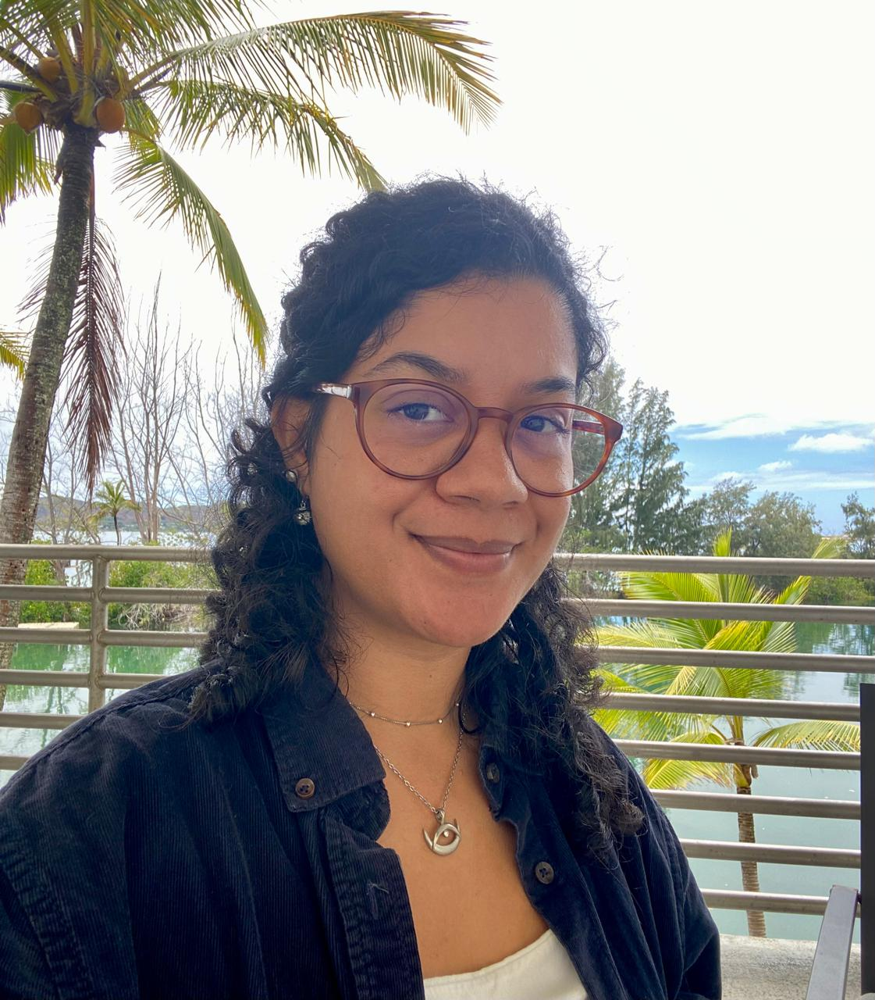

 

  

I am a PhD Candidate in [Ecology at University of São Paulo](https://posecologia.ib.usp.br/en/) (São Paulo, Brazil)  as part of [Dr. Paulo Inácio Prado lab](https://ecologia.ib.usp.br/let/doku.php?id=engl:prado:start) and [Dr. Flávia Maria Darcie Marquitti lab](https://www.ifi.unicamp.br/~flaviam/index.html) Currently you can find me at the University of Hawai'i at Manoa as I work as an intern at [Dr. Lisa C McManus lab](https://lmcmanus47.github.io/index.html).

In my research I use theoretical and computational approaches to better understand the mechanisms driving the population and community dynamics of marine systems. I am especially interested on coral reefs and understanding their potential responses to environmental change. 

Find out [what I have been up to](https://camposamanda.github.io/projects.html) and reach me out at camposam [at] hawaii [dot] edu if you would like more deets.

<a href="https://github.com/camposamanda/"> {width=6%} </a> 
<a href="https://scholar.google.com.br/citations?user=tF4Of2wAAAAJ&hl=en"> {width=5.5%} </a>