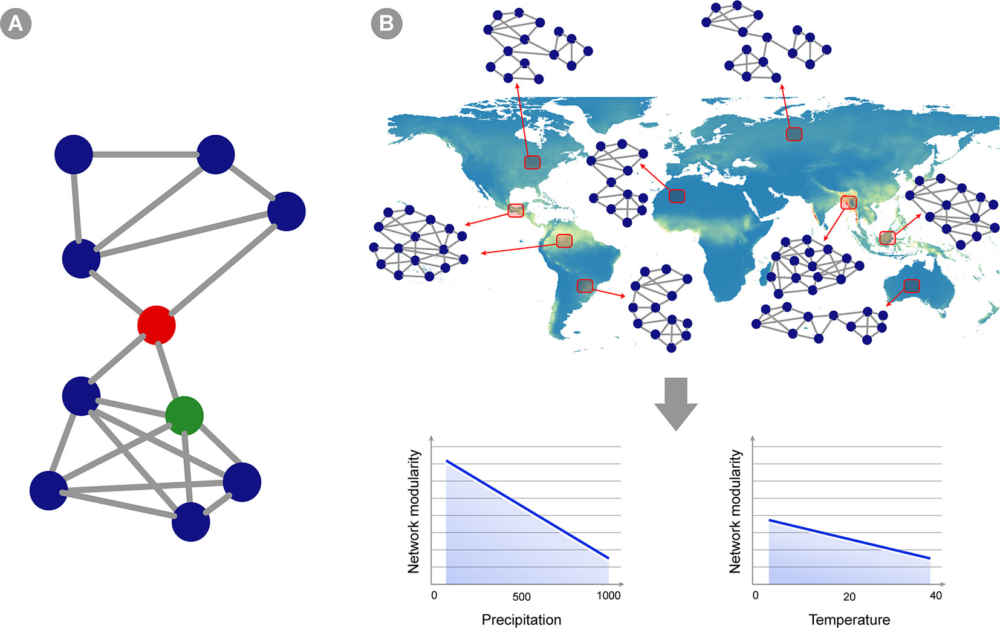

# Research

### Understanding microbial ecology across diverse ecosystems

  

Microbial communities are fundamental to ecosystem functioning, driving processes such as nutrient cycling, organic matter decomposition, and ecosystem resilience. Advances in metagenomics and large-scale environmental DNA sequencing have revolutionized our ability to study these communities, enabling unprecedented insights into their diversity, function, and biogeography. Our work leverages these tools to unveil the complexities of symbiotic interactions, the structure of microbial communities, and the ecological significance of rare taxa across diverse ecosystems, focusing on the critical role of microbial communities in shaping the biology and ecology of diverse ecosystems, from mangroves to coral reefs.

 

Related work:  
<a href = "https://link.springer.com/article/10.1007/s00248-021-01737-4">Campos et al. (2022) Microbial Ecology</a>  
<a href = "https://www.frontiersin.org/journals/genetics/articles/10.3389/fgene.2019.01344/full">Mascarenhas et al. (2020) Frontiers in Genetics</a>  
<a href = "https://journals.plos.org/plosone/article?id=10.1371/journal.pone.0200437">Brito et al. (2018) Plos ONE</a>  
 
 
 

### Adaptive capacity of ecological systems

Complex adaptive systems (CASs) are highly sensitive to both the magnitude and rate of environmental change, with rapid shifts often leading to destabilizing rate-induced transitions (RITs). In this project we investigate how rates of change interact with system dynamics, revealing critical thresholds and vulnerabilities, particularly in the Anthropocene era of accelerating environmental shifts. By analyzing RITs in networks and predator-prey dynamics, this work highlights the role of system connectivity and adaptability in resilience, providing tools to predict and mitigate vulnerabilities in ecological and socioecological systems.

Related work:  
<a href = "https://arxiv.org/abs/2309.07449">Vasconcelos et al. [pre-print]</a>  
 
 
 

### Coral reefs in the era of global warming

Coral reefs rely on a symbiotic relationship between reef-building corals and photosynthesizing dinoflagellates, which supply up to 90% of the corals' nutritional needs. However, rising global temperatures disrupt this symbiosis, leading to coral bleaching and threatening reef ecosystems. The resilience of coral reefs to climate change varies due to differences in coral morphotypes, symbiotic strategies, and regional conditions. While some corals can adapt through shifts in symbionts or evolving thermal tolerance, others remain vulnerable. In this project we investigate the interplay between eco-evolutionary dynamics and environmental changes in shaping the likelihood of critical transitions in coral reefs. We aim to advance our understanding of coral reef vulnerability and resilience, offering theoretical frameworks to predict and mitigate the impacts of climate change on this ecosystem.

 
 
 

# Tutorials

#### [Intro to numerical and analytical studies for a ODEs in Ecology](https://github.com/camposamanda/tutorials/blob/main/basic_analysis_predator-prey_model_quick_demo.ipynb) 
Check out this python script with the basics on how to study ecological systems using ODEs.
 
 

#### [Parallelize your python code](https://github.com/camposamanda/tutorials/blob/main/ptqdm_quick_demo.ipynb) 
If you ever find yourself not knowing when a python script will finish running, use this tutorial to learn how to implement a progress bar while your code is runs faster in parallel.
 
 

#### [Make your first github commit](https://github.com/camposamanda/tutorials/blob/main/your_first_github_commit_quick_demo.md)  
Dive in in this step-by-step tutorial on how to make your first github commit!
 
 

# Teaching

- [Teaching Assistant - Using R for Ecology 2023](http://ecor.ib.usp.br/doku.php?id=05_curso_antigo:r2023:start)
- [Tutor - Serrapilheira/ICTP Quantitative Ecology Program 2023](https://www.ictp-saifr.org/qecoprogram/)
- [Tutor - Escola de Biomatemática da Bahia 2022](https://2022.escolabiomat.com/2022/)
- [Tutor - Southern Summer School for Mathematical Biology (SSSMB) 2020](https://www.ictp-saifr.org/ix-southern-summer-school-on-mathematical-biology/)

